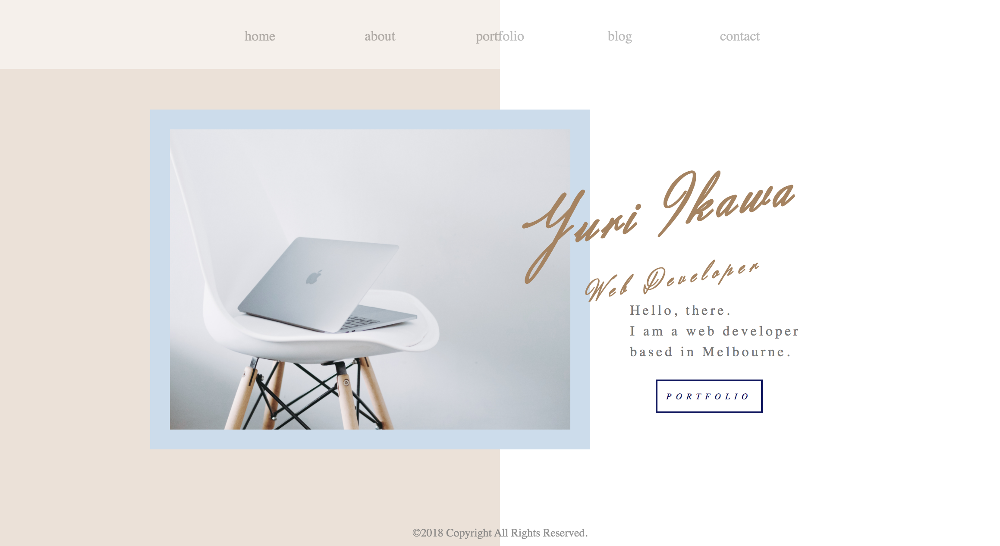
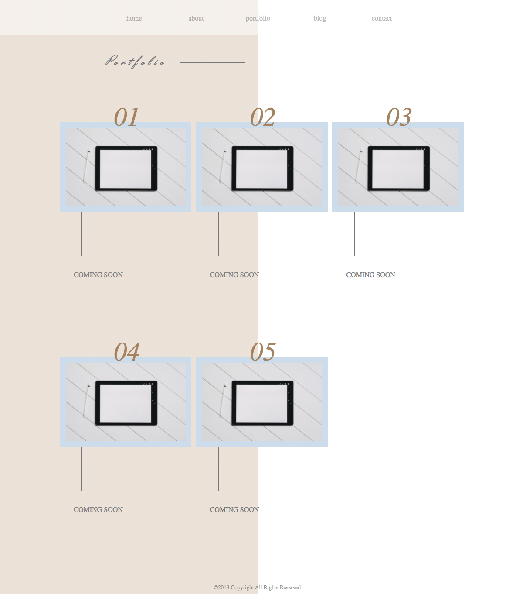
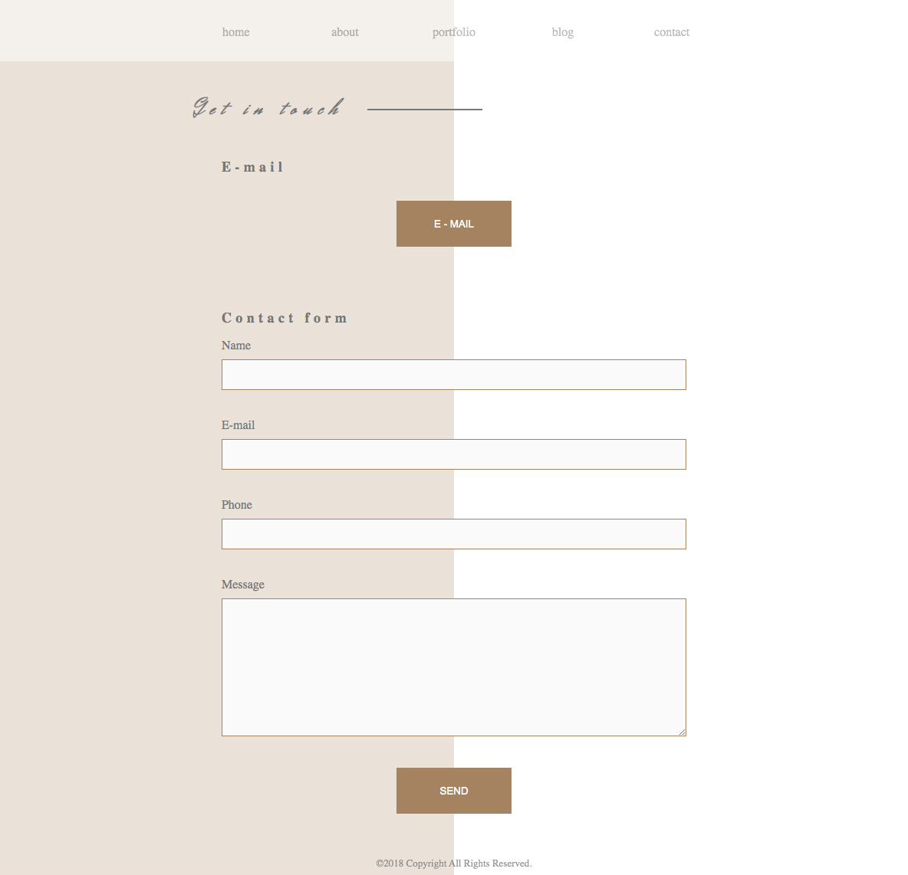

# portfolio

## Link for my portfolio website
<https://yuri-portfolio.netlify.app/index.html>

## link for my GitHub repo
<https://github.com/yrikw/portfolio>

## Description

### Purpose
This portfolio site is for sharing my work and job hunting. Also, to get good opportunities to work with other developers.

### Functionality / features
The design of the website is simple and clean. 
The navigation bar is situated at the top of the page for ease of access from all pages.

- Top page 
It seeks to give a simple but impactful impression to the viewers by centralizing a image and texts. 
- About  
My name, work history, education, skills and profile image and brief written introduction. 
- Portfolio  
Each of my work is set out as a clickable image which is directly linked to the website. 
- Blog  
Vertical orientation for easy navigation with scrolling up and down rather than horizontal orienrtation where clicking or sliding is needed.  
- Contact  
Simple straight forward contact page without any confusion. 

### Sitemap

### Screenshots

### Target Audience
1. Main audience - Potential web developer employers 
2. Sub audience - Job seekers who are also looking for a web developer job wanting to see what other job seekers are doing.

### Tech stack
1. HTML
2. CSS
3. Visual Studio Code
4. Balsamiq Wireframes

